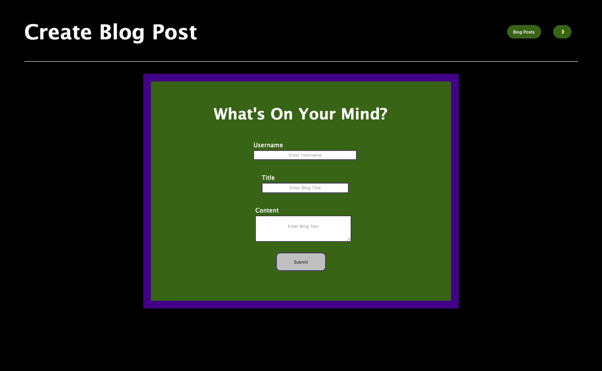

# Dynamic Blog

## Description

This project creates, stores, and renders blog posts dynamically.

It demonstrates my ability to work with:

- local storage
- DOM API

## Usage

Enter the author, title, and post on the first page. The post will be read into local storage. All created blogs will be rendered dynamically until local storage is cleared. It includes a feature to toggle between light and dark mode, and links to my professional portfolio.

This is the link to the deployed webpage: https://anullator.github.io/Dynamic-Blog/
